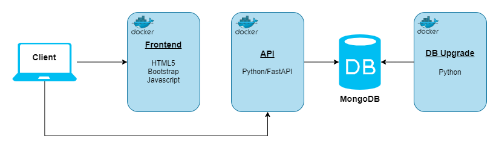

# Ragnarok

## Diagram



## Running

Create a `.env` file to configure some variables like this:

```dotenv
MONGO_ROOT_USERNAME=root
MONGO_ROOT_PASSWORD=changeme
ME_CONFIG_BASICAUTH_USERNAME=admin
ME_CONFIG_BASICAUTH_PASSWORD=admin
API_KEY=e8b1fbd9a8f4dfd9d430174bcfd2bfea
```

All variables are optional for development environments, except by `API_KEY` that needs to be set to **upgrader** microservice works.

Below the options and explanation about each variable:

| Variable                     | Default Value | Description                                                                                 |
| ---------------------------- | ------------- | ------------------------------------------------------------------------------------------- |
| MONGO_ROOT_USERNAME          | root          | Mongo DB root username. Cannot be changed after first execution until clean mongodb volume. |
| MONGO_ROOT_PASSWORD          | changeme      | Mongo DB root password. Cannot be changed after first execution until clean mongodb volume. |
| MONGO_HOST                   | mongo         | Mongo host.                                                                                 |
| MONGO_PORT                   | 27017         | Mongo port.                                                                                 |
| ME_CONFIG_BASICAUTH_USERNAME | admin         | Mongo Express admin username.                                                               |
| ME_CONFIG_BASICAUTH_PASSWORD | pass          | Mongo Express admin password.                                                               |
| API_KEY                      | \--           | [Divine Pride](https://www.divine-pride.net) API key.                                       |
| LOG_LEVEL                    | INFO          | Log level of upgrader microservice, can be DEBUG, INFO, WARNING, ERROR or CRITICAL.        |

```bash
docker compose up -d
```
